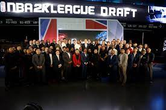

Hello fellow gamers! Im Teyon "Kinlaw Slim" Smith and I'm an avid NBA2K fan and has been playing the game since its inception.
I love the game for its realism, competitive nature, and the ability to create my own player and team. 
I've created a website dedicated to the upcoming installment of NBA2K, which he hopes will help others learn more about the game and get excited for its release. 
I believe that NBA2K is a great way to stay connected with friends, family, and the basketball community. 
This website provides news, tips, and strategies to help players get the most out of the game. 
I also provides reviews of the latest releases and upcoming features. 
I'm passionate about NBA2K and hopes that this website will help others enjoy the game as much as I do.
I want to Thank Mr. Norris in CTI-110 for pushing me to understand programming and coding to be able to make this website.
